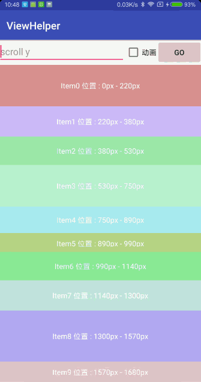

## ViewHelper
```
implementation 'com.dyhdyh:view-helper:1.0.3'
```
### DesignViewHelper
Material Design相关View的辅助类



```
//滚动AppBarLayout
DesignViewHelper.setAppBarLayoutOffset(appBar, offsetY);

//以动画的形式滚动AppBarLayout
DesignViewHelper.setAppBarLayoutOffsetWithAnimate(appBar, offsetY, duration);

//滚动AppBarLayout到顶部
DesignViewHelper.scrollAppBarTop(appBar, isAnimate);

//解决SwipeRefreshLayout嵌套AppBarLayout的滑动问题
DesignViewHelper.nestedSwipeAppBar(refreshLayout, appBar);

//解决SwipeRefreshLayout嵌套AppBarLayout和ViewPager的滑动问题
DesignViewHelper.nestedSwipeAppBarViewPager(refreshLayout, appBar, viewPager);

//设置SwipeRefreshLayout的颜色
DesignViewHelper.setSwipeRefreshLayoutColor(refreshLayout, colorRes);

//将SwipeRefreshLayout的颜色设为colorPrimary
DesignViewHelper.setSwipeRefreshLayoutPrimary(refreshLayout);

//滚动RecyclerView到指定位置
DesignViewHelper.scrollToPositionWithOffset(recyclerView, position, offset);

//滚动NestedScrollView到指定位置
DesignViewHelper.scrollToY(nestedScrollView, y);
```

## RecyclerViewHelper
Recyclerview 相关辅助类

```
compile 'com.dyhdyh:recyclerview-helper:1.0.0-beta16'
```

### RecyclerViewVisibleHelper
可以获取RecyclerView中子ItemView的可见信息，也可以继承`AbstractViewVisibleScrollListener`

```
RecyclerViewVisibleHelper mHelper = new RecyclerViewVisibleHelper(new RecyclerViewVisibleHelper.ViewVisibleCallback() {
    @Override
    public View getItemTargetView(View itemView) {
        //return你需要的子View可见信息 如果需要整个Item,则直接return itemView
        //return itemView.findViewById(R.id.video);
        return itemView;
    }
});

//获取当前显示在屏幕中的ItemView可见信息，按显示百分比倒序
final List<ViewVisibleInfo> visibleInfo = mHelper.getLocalVisibleInfo(recyclerView);
```

### OnAutoPlayScrollListener
基于`RecyclerViewVisibleHelper`预设的列表自动播放视频Listener

```
//自动播放
recyclerView.addOnScrollListener(new OnAutoPlayScrollListener(mHelper) {
    @Override
    public void startPlay(View itemView) {
        VideoView player = itemView.findViewById(R.id.video);
        player.start();
    }
});
```

### CheckableHelper
快速赋予RecyclerView Adapter单选/多选能力

### __单选Adapter__
将自定义的Adapter实现`SingleCheckableAdapter`，具体例子[SingleExampleAdapter](https://github.com/dengyuhan/CheckableHelper/blob/master/app/src/main/java/com/dyhdyh/helper/checkable/example/SingleExampleAdapter.java)   

```
SingleCheckableHelper singleHelper = new SingleCheckableHelper(this);

//设置position为选中，null则清除选中
singleHelper.setCheckedPosition(position);

//获取选中的position，null表示都没有选中
Integer checkedPosition = singleHelper.getCheckedPosition();
```

### __多Adapter__
将自定义的Adapter实现`MultipleCheckableAdapter`，具体例子[MultipleExampleAdapter](https://github.com/dengyuhan/CheckableHelper/blob/master/app/src/main/java/com/dyhdyh/helper/checkable/example/MultipleExampleAdapter.java)  

```
MultipleCheckableHelper multipleHelper = new MultipleCheckableHelper(this);

//设置多个为checked
multipleHelper.setCheckedPositionArray(position,checked);

//获取选中的position数组
int[] positionArray = multipleHelper.getCheckedPositionArray();

//获取选中的数据集合
List<Object> checkedList = multipleHelper.getCheckedList();

//清空所有选中
multipleHelper.clear();;

```

### LoadMoreHelper
给RecyclerView添加加载更多能力
